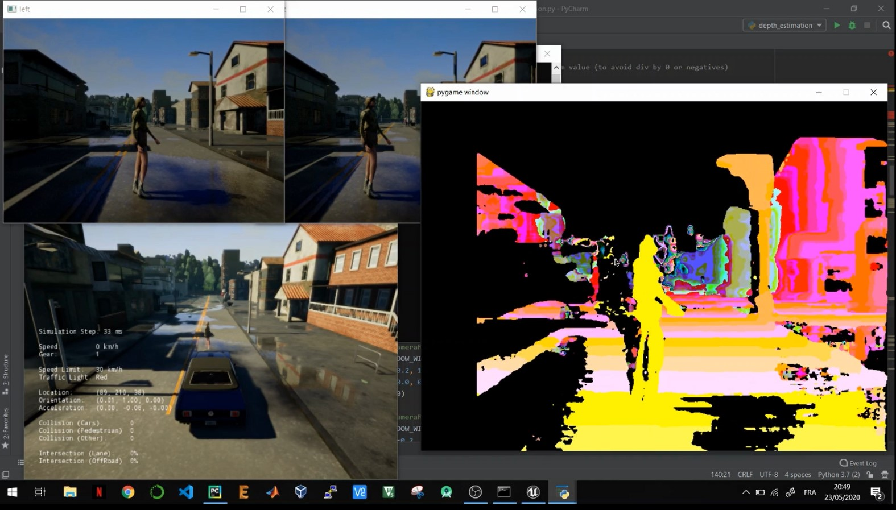

# Depth-Estimation-From-Stereo-Camera (Carla in Server-Client Mode)

Here we try to estimate the depth from a pair of stereo images as follow : 

- positioning the 2 camera sensors on the vehicle without rotation  
- getting their translation matrices 
- computing the disparity between the 2 images 
- computing the depth using the disparity and the translation matrices 

Here is an example - screenshots I took during the simulation

